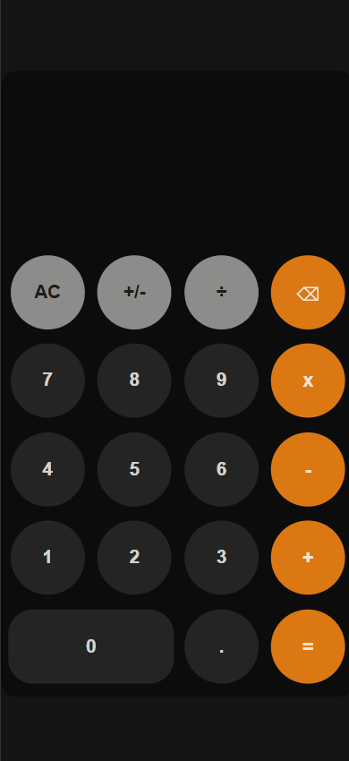

# CALCULADORA EM JAVASCRIPT
Projetado com Javascript puro, focado em implementar operações matemáticas básicas sem usar função eval() utilizando um algoritmo próprio.
Os principais desafios foram lidar corretamente com a precedência de operadores, gerenciar entradas do usuário e o estado da aplicação e validação e tratamento de bugs e comportamentos inesperados.

## TECNOLOGIAS USADAS:
- JAVASCRIPT (VANILLA)
- HTML5
- CSS3

## PRINCIPAIS FUNCIONALIDADES:
- Operações básicas (+, -, *, /)
- Suporte a números decimais
- Preview em tempo real de resultado
- Respeito a precedência de operadores
- Validação de entradas e tratamento de edge cases (divisão por zero, prevenir múltiplos operadores, etc.)
- Função de backspace e reset

## LÓGICA DA APLICAÇÃO
Ao invés de utilizar o eval(), criei uma lógica própria para resolver as equações:
  1. A equação é armazenada como um array de tokens
  2. O array de tokens é percorrido para identificar os operadores * e /
  3. Assim que o cálculo dos operadores anteriores são resolvidos, em seguida é resolvido os operadores + e -

Com a equação calculada localmente no array de tokens, o resultado é exibido para o usuário com o resultado correto por precedência.

## PREVIEW


## APRENDIZADOS:
- Controle e manipulação de estados sem frameworks
- Conhecimento sobre Parsing de expressões matemáticas (resolução de expressões em duas etapas)
- Manipulaçção e controle de eventos DOM
- Tratamento de "Edge Cases"
- Devida separaração de responsabilidades no código

## FUTUROS UPGRADES:
- Suporte a teclado
- Histórico de operações/equação
- Refatoramento para REACT

## RODANDO O PROJETO
```bash
git clone https://github.com/nicoperes/calculator-js
cd calculator-js
